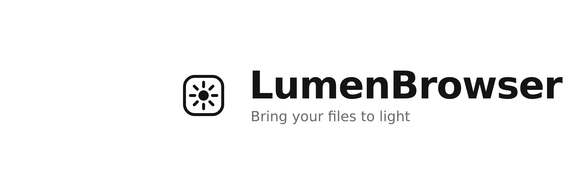

<p align="center">
  <!-- branding 占位：把 LumenBrowser 的 banner 放到 branding/banner.png 后替换下面这行 -->
  <!--  -->
  <strong>LumenBrowser</strong>
</p>

<p align="center"><em>你的文件之光 / Bring your files to light</em></p>

LumenBrowser 是一个**自托管的文件存储 / 分享 + 轻量文档协作门户**，面向个人与小团队。它把一台服务器（或一个目录）变成干净、私有、完全归你掌控的文件库：对内是带登录的多用户文件管理器，对外是免登录的文档门户与投递箱。

整套产品是**单个 Go 二进制 + 一个数据库文件**（前端已内嵌进可执行文件），Docker 一行即可启动，数据始终留在你自己的服务器上。

> LumenBrowser 基于开源项目 [filebrowser](https://github.com/filebrowser/filebrowser) v2.62.2 二次开发，遵循 Apache License 2.0。仓库：`github.com/socake/filebrowser-mods`。

---

## 核心功能

### 文件管理（私有，需登录，多用户）

继承自 filebrowser 成熟的文件管理内核：

- 浏览 / 列目录、新建目录、上传、保存覆盖、复制 / 重命名 / 移动、删除
- 大文件**断点续传**（tus 协议），传输中断后可续传
- 原始下载与**打包下载**（zip / tar / targz 等多种格式）
- 缩略图 / 预览图、字幕、磁盘用量、流式搜索
- 多用户与细粒度权限位（create / modify / rename / delete / download / share），管理员可管理用户与全局设置
- 内置编辑器，文本 / Markdown 在线编辑并预览

### 分享

- 对任意文件 / 目录生成分享链接，可选**设置密码与有效期**
- 分享 hash 采用 **24 字节** 随机熵（base64-url），显著抗遍历与猜测
- 「我的分享」列表与撤销；过期分享惰性清理

### 对外协作层（二改差异化，重点）

经典 filebrowser 的全部接口都在 `/api` 鉴权链路上（私有）。LumenBrowser 的核心差异化在于新增了一组**匿名免登录、注册在根 router** 的对外接口：

- **公开文档门户 `/docs`** —— 把服务器 root 目录当成一份在线文档库**只读对外展示**。零依赖单页（HTML 内嵌进二进制），左侧目录树 + 右侧预览，支持 Markdown 渲染、代码高亮（highlight.js）、drawio 图（diagrams.net viewer）。列表与预览自动跳过点开头文件及敏感名文件（`credentials / secrets / password / .env / id_rsa / id_ed25519 / token`）。
- **免登录投递箱 `POST /api/public/upload`** —— 任何人 POST 一个文件即可拿到永久分享链接，文件落到 `/uploads/` 并加时间戳前缀防冲突。适合收作业、收外部投稿等场景。
- **增强分享页** —— 分享链接支持 Markdown / 文本在线预览与语法高亮，密码分享交互更顺，不再只能盲下载。

> ⚠️ **安全提示**：对外协作层（`/docs`、`/api/public/upload`）当前是**匿名开放**的，定位适合**可信内网或临时场景**。裸暴露公网前请评估访问控制、限速与敏感文件过滤等事项。

### 自托管

- 单二进制 + 单数据库文件，前端 dist 已内嵌，无需额外运行时
- 数据全程在你自己的服务器上，不经过任何第三方
- Docker 一行启动，或源码 `go build` 自行构建

---

## CLI 客户端 `lumen`

`lumen` 是 LumenBrowser 的命令行客户端（仓库内独立 Go 模块 `github.com/socake/filebrowser-mods/client`，第一版刻意零外部依赖、纯标准库）。服务端无需任何改动，全部走既有 REST API，便于**脚本化、CI 集成、批量上传与定时备份**。

```bash
# 登录并保存连接配置到 ~/.lumen/config.json
lumen login https://files.example.com -u alice -p secret

# 列出远程目录
lumen ls /documents

# 免登录投递：上传文件即得永久分享链接
lumen drop ./report.pdf --server https://files.example.com
```

当前 `login` / `ls` / `drop` 为最小验证链路（骨架推进中），`put / get / rm / mv / mkdir / share / shares / search` 等命令在规划中。完整命令表、状态与配置说明见 [`client/README.md`](client/README.md)。

---

## 部署

### 首次启动 / 默认管理员账号

在没有任何已存在配置或数据库的情况下首次启动时，LumenBrowser 会自动执行 quick setup，创建第一个管理员账号：

| 项目 | 默认值 |
| --- | --- |
| 用户名 | `admin` |
| 密码 | `admin` |
| 界面语言 | 简体中文（zh-cn） |

打开 Web 界面用 `admin` / `admin` 即可直接登录，开箱即用。

> ⚠️ **安全警告：默认密码 `admin` 仅为开箱即用，切勿在生产环境保留！**
>
> 默认 `admin/admin` 凭据是公开已知的。任何把服务暴露到公网而不修改默认密码的部署，等同于将整台服务器的文件读写权限直接交给所有人，存在**严重安全风险**。
>
> 部署后请**立即**修改默认密码，二选一：
>
> - **Web 界面**：右上角进入 *设置 → 个人设置（Profile Settings）*，修改密码。
> - **CLI**（需先停止正在运行的服务，避免数据库占用）：
>
>   ```bash
>   filebrowser users update admin --password <新密码> --database ./filebrowser.db
>   ```
>
> 若用自定义凭据初始化，首次启动时通过 `--username` / `--password` 传入即可（`--password` 接收的是已哈希的密码值）。

### Docker

最简单的方式是用 Docker Compose（仓库根 `compose.yaml`，含可选 Redis 缓存）：

```bash
docker compose up --build
```

或自行构建镜像后用 `docker run`（容器内监听 80 端口，数据卷为 `/srv`、配置 `/config`、数据库 `/database`）：

```bash
docker build -t lumenbrowser .
docker run -d \
  -p 8080:80 \
  -v $(pwd)/srv:/srv \
  -v $(pwd)/config:/config \
  -v $(pwd)/database:/database \
  lumenbrowser
```

### 源码构建（前端已内嵌）

需要 Go 1.25+。前端构建产物会通过 `go:embed` 打进最终二进制：

```bash
# 1. 构建前端
cd frontend && pnpm install && pnpm build && cd ..

# 2. 构建后端（产物内嵌前端 dist）
go build -o filebrowser

# 3. 运行
./filebrowser --address 0.0.0.0 --port 8080 --root <要暴露的目录> --database ./filebrowser.db
```

CLI 单独构建：

```bash
go build -o lumen ./client
```

---

## 与上游 filebrowser 的关系 / 致谢

LumenBrowser 站在 [filebrowser](https://github.com/filebrowser/filebrowser)（v2.62.2）的肩膀上构建，复用了它经过验证的文件管理内核（资源 CRUD、断点续传、预览、搜索、分享、多用户权限）。在此基础上，本分支补齐了一整套**对外协作层**（文档门户、免登录投递箱、增强分享页、Markdown 优先）并做了若干安全加固。

为保持可对照，仓库的 Go module 路径仍是上游的 `github.com/filebrowser/filebrowser/v2`；分支约定为 `master` = 纯净上游、`my-mods` = 本人二改，两者 diff 即全部改动。

衷心感谢 filebrowser 的作者与所有贡献者。本项目遵循上游的 **Apache License 2.0**，并在根目录 [`NOTICE`](NOTICE) 中保留原始版权归属、列明本分支的主要修改。

---

## License

[Apache License 2.0](LICENSE)。本产品基于 filebrowser（同为 Apache-2.0）二次开发，原始版权归 File Browser Contributors，二改部分版权归 LumenBrowser 贡献者。详见 [`LICENSE`](LICENSE) 与 [`NOTICE`](NOTICE)。
