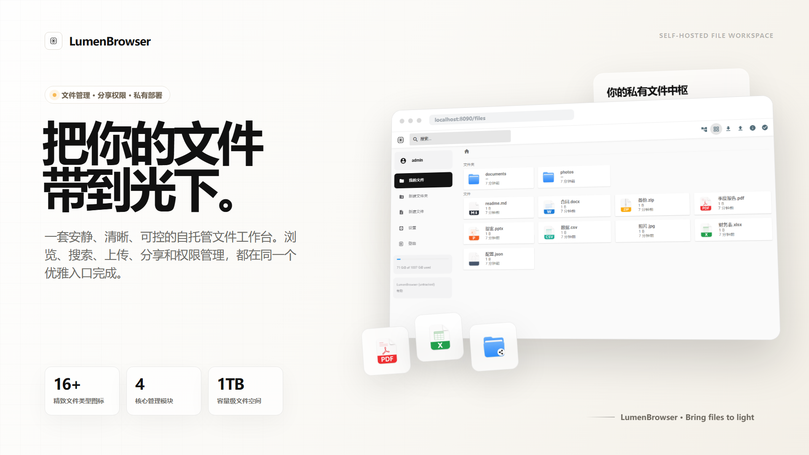
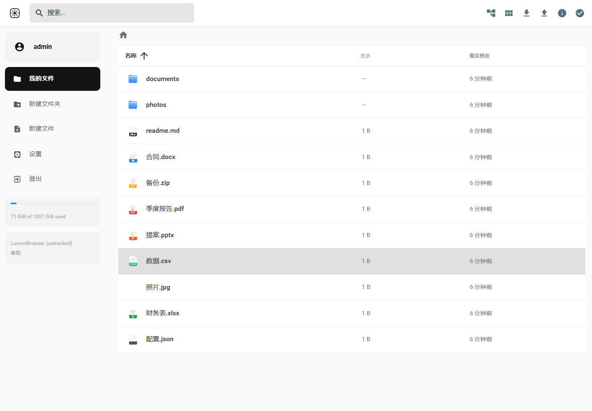
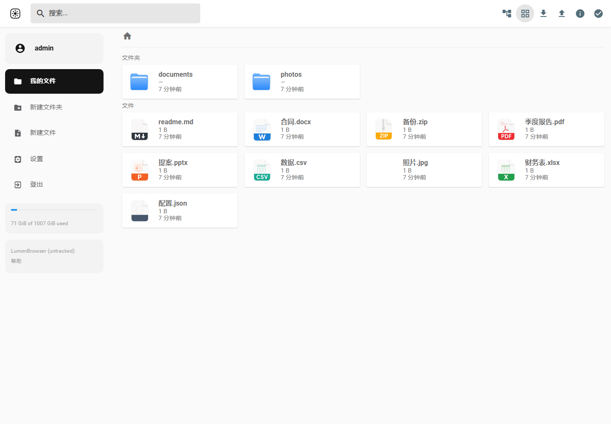
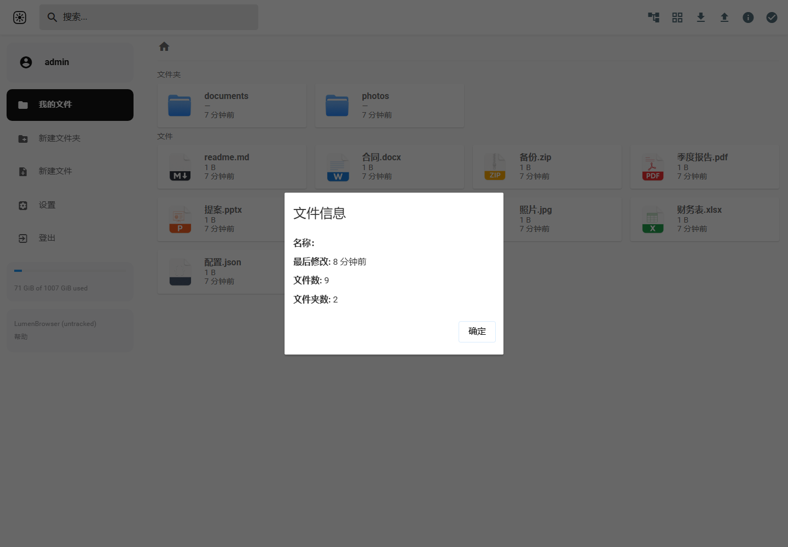
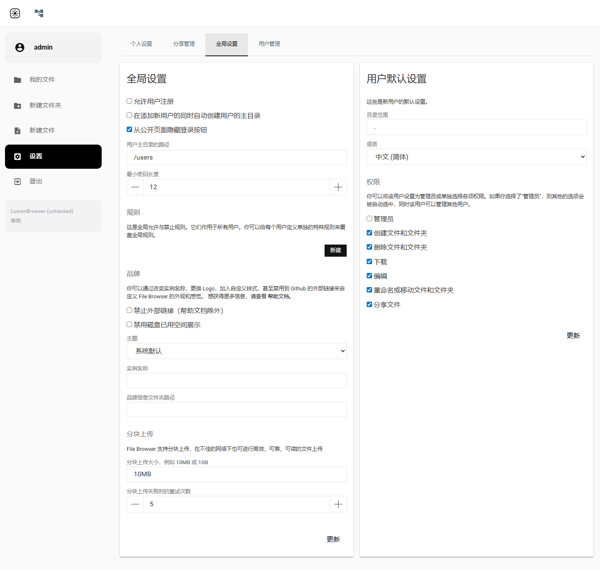
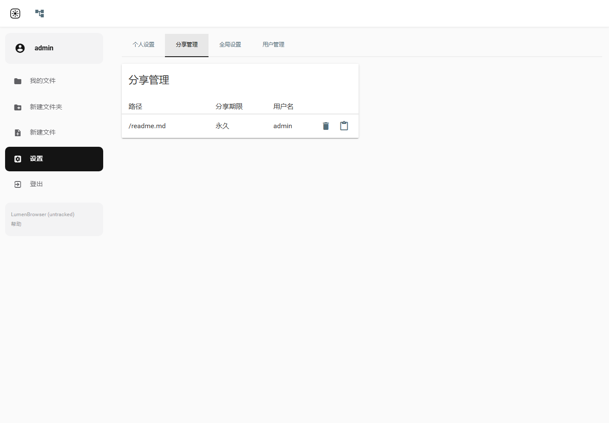
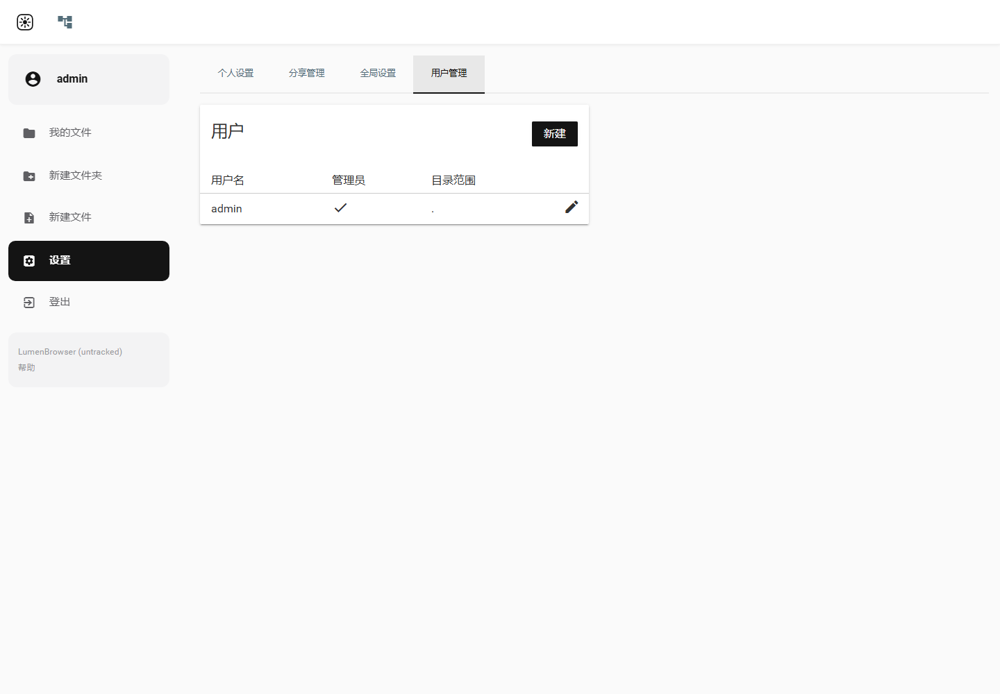
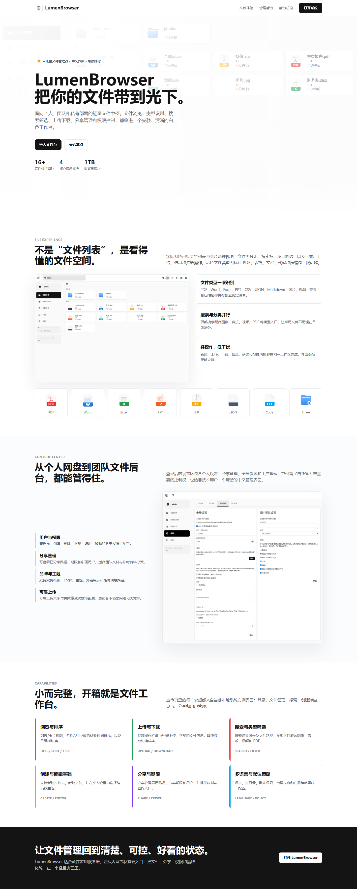

<p align="center">
  
</p>

<h1 align="center">LumenBrowser</h1>

<p align="center"><strong>把你的文件带到光下 · Bring files to light</strong></p>

<p align="center">
  自托管的文件工作台 —— 在线预览 / AI 助手 / 角色权限 / 分享，一个 Go 二进制全搞定。
</p>

<p align="center">
  <a href="./LICENSE"></a>
  
  
  
  
  
</p>

<p align="center">
  <strong><a href="https://file.vishine.top">🌐 在线演示</a></strong> ·
  <strong><a href="docs/DEPLOY.md">📦 私有化部署文档</a></strong> ·
  <strong><a href="mcp/README.md">🤖 MCP 接入</a></strong>
</p>

---

## ✨ 简介 / What is LumenBrowser

**LumenBrowser** 是一个**自托管的文件工作台**，基于成熟的开源项目 [filebrowser](https://github.com/filebrowser/filebrowser) 深度二次开发、重新产品化而来。它把一台服务器（或一个目录）变成干净、私有、完全归你掌控的文件库 —— 既能像网盘一样在线预览图片、视频、Office、PDF、代码，也能接入 Claude / qwen 等 AI 用自然语言操作文件，还自带角色权限、两种分享、目录树面板和命令行工具。

整套产品是**单个 Go 二进制 + 一个数据库文件**：前端 dist 与各平台 MCP 二进制都已通过 `go:embed` 打进可执行文件，Docker 一行即可启动，数据始终留在你自己的服务器上。

设计上走**纯白 To C 风格**，主色近黑 `#141414`、零彩色零渐变，把原版偏「工具感」的后台界面，重做成一套体面、克制、对得起每天使用的体验。

> Slogan：**把你的文件带到光下 · Bring files to light**。

---

## 🤔 为什么做这个

filebrowser 是个很好的文件管理器内核 —— 资源 CRUD、断点续传、搜索、分享、多用户权限都很扎实。但它终究是一个**工具**，不是一个**产品**：界面偏工程师审美，预览能力有限（Office 基本看不了），没有现代化的角色权限体系，更没有 AI 的位置。

我想要的不是「能用的文件管理器」，而是一个**自己每天愿意打开的文件工作台**：

- 任何文件点开就能在线看 —— 图片、视频、音频、PDF，连 Word / Excel / PPT 都直接在网页里渲染，不用下载到本地再开。
- 文件操作能交给 AI —— 内置 MCP server，接上 Claude 就能「帮我搜一下包含季度报告的文件并生成下载分享」。
- 权限要直观 —— 四个预设角色 + 一张可视化权限矩阵，勾掉的权限直接从界面上消失，而不是点了才报错。
- 分享要分场景 —— 给人「在线看」和给人「直接下」是两件事，要能分别处理，还要有密码、有效期、二维码。
- 部署要简单、数据要归我 —— 一个二进制，Docker 一行，数据永远在自己的服务器上。

于是有了 LumenBrowser。它站在 filebrowser 的肩膀上，补齐了**在线预览 / AI 助手 / 角色权限 / 产品化界面**这几块，把「一个文件管理器」做成了「一个文件工作台」。

---

## 🖼 截图

### 🖥 桌面端

| 登录后首页 | 网格视图 + 彩色图标 | 文件信息 / 预览 |
| :---: | :---: | :---: |
|  |  |  |
| **搜索 + PDF 在线预览** | **设置（角色权限 / MCP / 主题）** | **分享管理** |
|  |  |  |

| 用户管理 | 产品宣传图 |
| :---: | :---: |
|  |  |

> 在线演示：**[file.vishine.top](https://file.vishine.top)**（默认 `admin` / `admin`，仅供体验）。

---

## 🚀 核心特性

### 👀 多类型在线预览

点开即看，无需下载到本地再打开。图片、视频、音频原生播放，PDF 内嵌阅读；**Office 文档（docx / xlsx / pptx）由 [vue-office](https://github.com/501351981/vue-office) 在网页内直接渲染**，无需服务端装 LibreOffice、也不调任何第三方。Markdown 实时渲染、代码文件语法高亮。配套 **16+ 彩色文件类型图标**（PDF / Word / Excel / PPT / Markdown / 图片 / 视频 / 音频 / 压缩包 / 代码 / JSON…），列表一眼可辨，未知类型有兜底图标。

### 🤖 AI 助手接入（MCP）

内置 **MCP server**，可接入 Claude Desktop、qwen 等任意支持 [Model Context Protocol](https://modelcontextprotocol.io) 的客户端，让 AI 用自然语言操作你的文件库。提供 5 个工具：`list_files`（列目录）、`search_files`（搜索）、`read_file`（读文件）、`upload_file`（上传）、`create_share`（创建分享），足以覆盖「列一下根目录」「搜包含 report 的文件」「把这份 PDF 上传并生成下载分享」这类指令。**设置页可一键生成访问令牌**（永久 / 7 天 / 30 天 / 90 天 / 1 年），并直接下载各平台预编译的 `lumen-mcp` 二进制（Windows / macOS Intel & Apple Silicon / Linux），免去自行构建 —— 二进制已随主程序一并内嵌。详见 [`mcp/README.md`](mcp/README.md)。

### 🛡 RBAC 角色权限

内置 **4 个预设角色**（管理员 / 编辑者 / 查看者 / 访客）+ **可视化权限矩阵**，谁能创建、修改、重命名、删除、下载、分享一目了然。支持设置**新用户默认角色**，也支持对单个用户做**个人权限覆盖**。最关键的是权限**直接作用到界面**：没有的权限对应的按钮和入口会自动隐藏，而不是点了才弹「无权限」，干净且不易误操作。

### 🔗 两种分享

分场景设计的分享能力：**预览分享**（对方在线浏览 / 阅读）与**下载分享**（对方直接下载），都可设置**密码、有效期，并自动生成二维码**便于手机扫码。分享 hash 采用 24 字节随机熵（base64-url），抗遍历猜测。**分享管理页**支持多选批量操作，并可按类型 / 时间筛选，过期分享惰性清理。

### 🌳 目录树面板

可选的右侧目录树侧栏，懒加载子目录、进入当前路径自动展开一层、每个文件夹显示项目数 badge（折叠时也显示）。顶栏一键开关，状态记忆到本地，大目录导航更顺手。

### ⌨️ lumen CLI

随仓库提供命令行客户端 `lumen`（独立 Go 模块，零外部依赖），把服务端 REST API 封装成 **11 个命令**：`login` / `profile` / `ls` / `put`（tus 断点续传 + 进度）/ `get` / `rm` / `mv` / `mkdir` / `share` / `shares` / `search` / `drop`，适合**脚本化、CI 集成、批量上传与定时备份**。详见 [`client/README.md`](client/README.md)。

### 🪪 登录页 + 公开宣传页

重做的品牌化登录页，以及一个免登录的公开介绍页 `/about`，方便对外展示这台实例是什么、能做什么。

### 🏠 自托管，数据完全归你

单二进制 + 单数据库文件，前端与 MCP 已内嵌，无需额外运行时。数据全程在你自己的服务器上、不经过任何第三方，私有云 / 公有云皆可部署。

---

## ⚡ 快速开始

> 想要最详细的逐步部署（交叉编译、镜像仓库分发、Nginx 反代、HTTPS 证书、备份），见 **[私有化部署文档 `docs/DEPLOY.md`](docs/DEPLOY.md)**。下面是最短路径。

### 方式 A：Docker 一行起（推荐）

二进制由本地 [`scripts/build.sh`](scripts/build.sh) 构建好（已内嵌前端 + MCP），再用 [`Dockerfile.demo`](Dockerfile.demo) 打包：

```bash
# 1. 构建二进制（产出 ./filebrowser）
./scripts/build.sh

# 2. 打镜像
docker build -f Dockerfile.demo -t lumenbrowser .

# 3. 运行（80 端口，挂载你的数据目录与数据库）
docker run -d --name lumenbrowser \
  -p 80:80 \
  -v /your/data:/srv \
  -v /your/db:/db \
  lumenbrowser
```

打开浏览器访问服务器地址，用默认账号 **`admin` / `admin`** 登录。

> ⚠️ **务必立即修改默认密码！** 默认 `admin/admin` 是公开已知凭据，暴露公网而不改密码等于把整台服务器的文件读写权交给所有人。登录后进入 *设置 → 个人设置* 修改。

### 方式 B：源码构建本机运行

需要 **Go 1.25+**、**Node + pnpm**：

```bash
# 一键构建（交叉编译 MCP → vite build 前端 → CGO_ENABLED=0 静态编译后端）
./scripts/build.sh

# 运行
./filebrowser -r /要暴露的目录 -d ./filebrowser.db -a 0.0.0.0 -p 8080
```

> ⚠️ **关键坑**：后端必须 **`CGO_ENABLED=0` 静态编译**，否则在 alpine / musl 等环境运行会报 `exec ... no such file or directory`。`scripts/build.sh` 已默认带上，手动 `go build` 时别忘了。

---

## 🔧 配置

| 启动参数 | 作用 | 示例 |
| --- | --- | --- |
| `-r, --root` | 对外暴露的根目录 | `-r /srv` |
| `-d, --database` | 数据库文件路径 | `-d ./filebrowser.db` |
| `-a, --address` | 监听地址 | `-a 0.0.0.0` |
| `-p, --port` | 监听端口 | `-p 8080` |

- **首次启动**：在没有任何已存在配置 / 数据库时，会自动执行 quick setup，创建第一个管理员账号（默认 `admin` / `admin`，界面语言简体中文）。
- **改密码**：Web 界面 *设置 → 个人设置*；或停服后用 CLI `filebrowser users update admin --password <新密码> --database ./filebrowser.db`。
- **角色与权限**：*设置 → 角色权限*，配置预设角色权限矩阵与新用户默认角色。
- **AI / MCP 令牌**：*设置 → MCP*，生成访问令牌并下载对应平台的 `lumen-mcp` 二进制。
- **上传体积**：放到 Nginx 后面时记得设 `client_max_body_size 0`，否则大文件上传会被截断（见部署文档）。

更详尽的部署配置（镜像仓库分发、Nginx 反代、certbot HTTPS、备份方案）请阅读 **[`docs/DEPLOY.md`](docs/DEPLOY.md)**。

---

## 💖 赞助 / Sponsor

LumenBrowser 是用业余时间一点点折腾出来的。如果它帮你省下了时间，或者你欣赏这份折腾劲儿，欢迎 **点个 Star ⭐、关注 [GitHub](https://github.com/socake)** —— 这是对我最实在的支持。

你的每一份支持，都会变成继续维护、继续写文档的动力。

---

## ⭐ Star History

如果这个项目对你有用，点个 Star 是对我最直接的鼓励 ⭐

[](https://star-history.com/#socake/LumenBrowser&Date)

---

## 🙏 致谢

LumenBrowser 二次开发自 **[filebrowser](https://github.com/filebrowser/filebrowser)**（© File Browser Contributors，Apache-2.0），复用了它经过验证的文件管理内核（资源 CRUD、断点续传、预览、搜索、分享、多用户权限）。在此基础上补齐了在线预览、AI 助手（MCP）、角色权限与产品化界面。衷心感谢上游的作者与所有贡献者 —— 没有它，就没有 LumenBrowser。

原始版权归属与本分支主要修改详见根目录 [`NOTICE`](NOTICE)。

---

## 📄 License

本项目以 **[Apache License 2.0](LICENSE)** 发布（继承 filebrowser）。原始版权归 File Browser Contributors，二改部分版权归 LumenBrowser 贡献者。详见 [`LICENSE`](LICENSE) 与 [`NOTICE`](NOTICE)。

---

<p align="center">
  把你的文件带到光下 · <a href="https://github.com/socake/LumenBrowser">github.com/socake/LumenBrowser</a>
</p>
